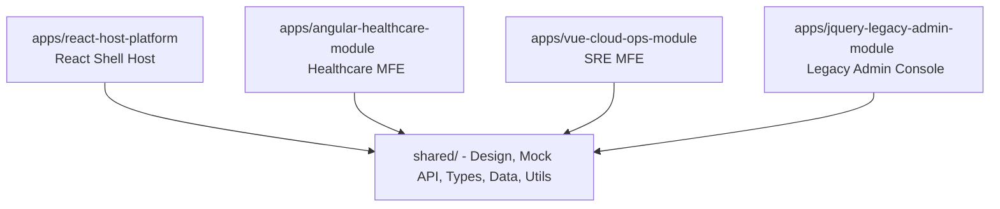

# Project Overview

The **Bank Operations Management Platform** is a streamlined, premium commercial SaaS dashboard designed to monitor banking customers, clearing transactions, AI security alerts, and system reports from a single clean interface. 

Inspired by the minimal design quality of Stripe, Linear, and Vercel, the platform prioritizes user experience, visual clarity, and business storytelling over technical complexity. It is designed to be instantly understood by both technical and non-technical viewers (such as recruiters or hiring managers) within 10 seconds of opening.

---

# What Problem Does It Solve?

Large financial enterprises often maintain separate, disconnected software systems for managing customer cohorts, auditing transactions ledger, and monitoring security threats. These systems are typically overcrowded, difficult to navigate, and dense with technical jargon.

This platform solves this problem by consolidating these independent operations into one unified, elegant, and minimal Operations Command Center. It provides high-level business analytics, searchable transaction histories, card-based customer profile lists, and prioritized alert registers in a responsive space-friendly layout, reducing operational overhead and accelerating decision-making.

---

# Features

### 1. Unified Operations Dashboard
An elegant overview screen displaying exactly four essential business summary metrics (Total Customers, Active Accounts, Transactions Today, and Open Alerts), followed by an interactive, glowing transactions trends graph and recent system alerts overview panels.

### 2. Card-Based Customer Directory
A clean, card-based list representing patient and customer cohorts, replacing dense, multi-column tables with highly readable, rounded cards detailing account IDs, status flags, and joined history logs.

### 3. Searchable Transactions Ledger
A searchable, pristine database ledger showcasing checkings, deposits, and clearing events in a clean typography grid layout.

### 4. Priority Operations Alerts
Prioritized risk warning panels grouped cleanly by **High, Medium, and Low** tags, ensuring operational operators can immediately mitigate financial or access anomalies.

---

# Technologies Used

- **React.js**: Powers the primary SaaS landing page, dynamic login gateways, and consolidated dashboard router views.
- **Angular 17**: Orchestrates the secure clinical patient structures and reactive form validators.
- **Vue 3**: Builds lightweight SRE telemetry trackers, Kubernetes node charts, and responsive inline SVG graphics.
- **jQuery & AJAX**: Integrates legacy database connections adapter components, handling deferred requests in the background.
- **Sass**: Customizes dark theme variables, rounded card mixins, status badges, and spacing tokens.
- **TypeScript**: Establishes strict data schemas and mock API contract verification.

---

# Architecture

The system consolidates four independent micro-frontend apps under one React host container shell utilizing shared domain layers.



---

# Setup Instructions

Follow this step-by-step, beginner-friendly guide to run the platform locally in under 2 minutes:

### 1. Global Setup
Ensure you have **Node.js** (version 18 or newer) installed.

### 2. Install Packages
Open your terminal and run these commands to install dependencies:

```bash
# Clone the repository
git clone https://github.com/your-username/enterprise-frontend-modernization-platform.git
cd enterprise-frontend-modernization-platform

# Install dependencies for individual MFE apps
cd apps/react-host-platform && npm install
cd ../angular-healthcare-module && npm install
cd ../vue-cloud-ops-module && npm install
```

### 3. Launch the Platform (Root level)
Return to the root workspace folder and use root-level shortcuts to serve individual apps:

```bash
# Start the primary Vercel-ready React Host (Port 5173)
npm run dev:react

# Start the Vue SRE dashboard (Port 5174)
npm run dev:vue

# Start the Angular Healthcare app (Port 4200)
npm run dev:angular

# Serve the legacy jQuery console (Port 3000)
npm run serve:jquery
```

Open **`http://localhost:5173`** in your browser to experience the platform!
