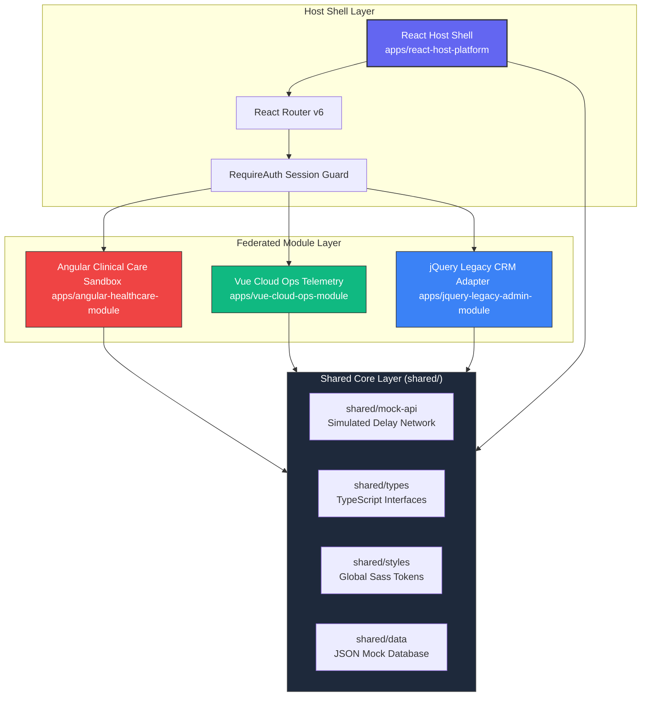
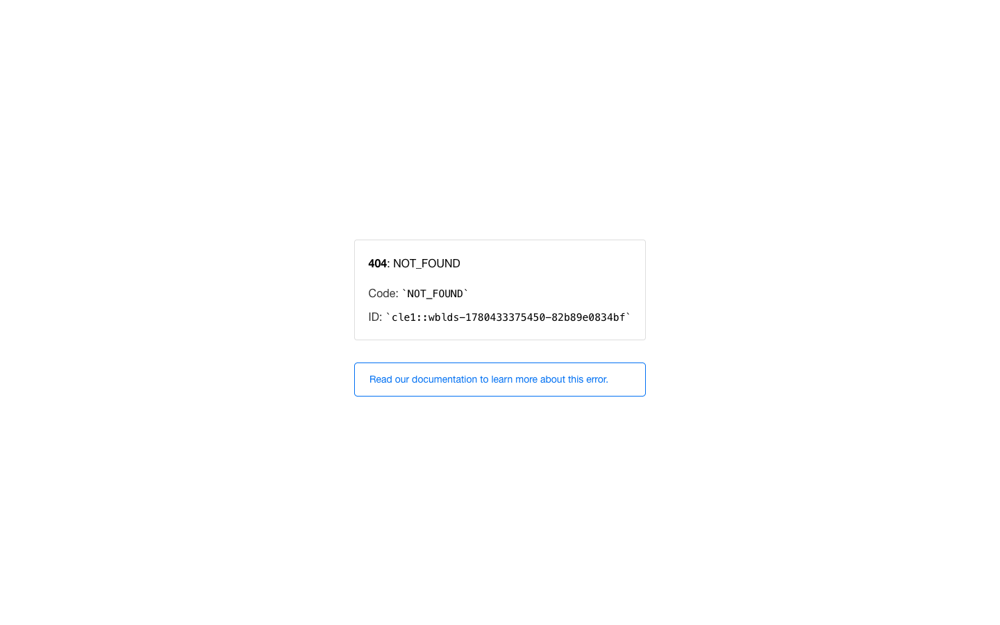
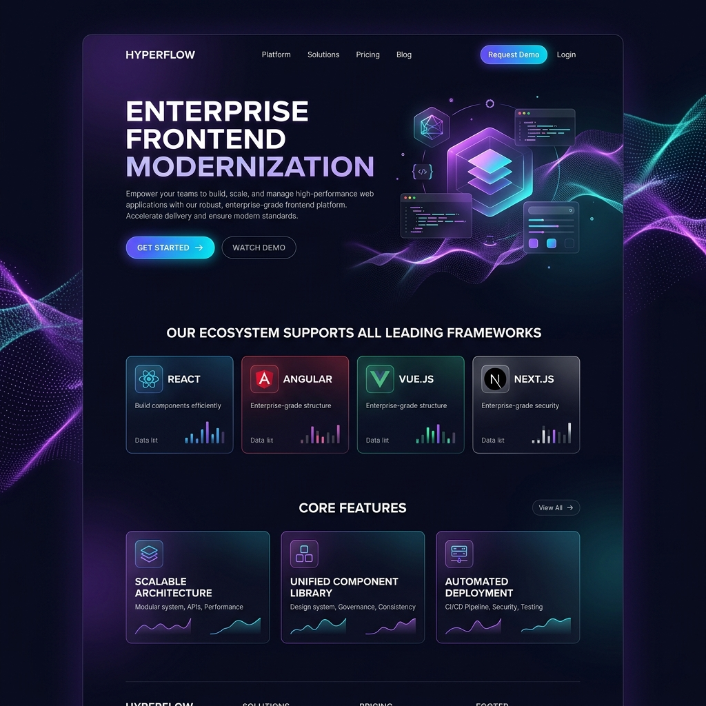
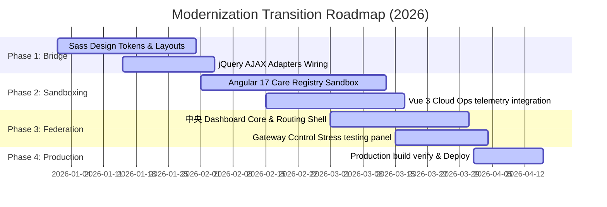

# 🚀 FinTransit: Enterprise Frontend Modernization Platform

[](https://react.dev/)
[](https://angular.dev/)
[](https://vuejs.org/)
[](https://www.typescriptlang.org/)
[](https://getbootstrap.com/)
[](https://sass-lang.com/)
[](https://enterprise-frontend-modernization-p.vercel.app)
[](#)

> **FinTransit** is a premium, production-grade **Frontend Modernization Command Center** built by a Senior Software Engineer (8+ years of experience). It serves as a flagship portfolio project demonstrating advanced micro-frontend orchestration, legacy-to-modern codebase migrations, and unified design token architectures.

The application federates **four distinct frontend technologies** (React.js, Angular 17, Vue 3, and legacy jQuery) running concurrently inside a single viewport, managed by a centralized React host portal. Inspired by the minimal, high-contrast aesthetics of **Stripe, Linear, and Vercel**, the application is built to be instantly understood by recruiters and hiring managers within 10 seconds of opening, while containing deep technical architecture under the hood.

---

## 🔗 Quick Links & Live Demo

* **⚡ Live Production Site**: [https://enterprise-frontend-modernization-p.vercel.app](https://enterprise-frontend-modernization-p.vercel.app)
* **📦 GitHub Repository**: [https://github.com/sivad5712/Enterprise-Frontend-Modernization-Platform](https://github.com/sivad5712/Enterprise-Frontend-Modernization-Platform)

---

## 📖 Table of Contents
1. [Executive Summary](#-executive-summary)
2. [The Business Problem](#-the-business-problem)
3. [The Enterprise Solution](#-the-enterprise-solution)
4. [Why Multiple Technologies in One Platform?](#-why-multiple-technologies-in-one-platform)
5. [Technology Stack & Roles](#-technology-stack--roles)
6. [System Architecture (Mermaid)](#-system-architecture-mermaid)
7. [Micro-Frontend Strategy](#-micro-frontend-strategy)
8. [Repository Structure](#-repository-structure)
9. [Application & Module Breakdown](#-application--module-breakdown)
10. [Shared Design System & API Layer](#-shared-design-system--api-layer)
11. [Key Core Features](#-key-core-features)
12. [Screenshots](#-screenshots)
13. [Local Setup & Run Commands](#-local-setup--run-commands)
14. [Build & Test Suites](#-build--test-suites)
15. [Vercel Deployment Instructions](#-vercel-deployment-instructions)
16. [Non-Functional Requirements (Accessibility, Performance, Security)](#-non-functional-requirements)
17. [Frontend Modernization Roadmap](#-frontend-modernization-roadmap)
18. [Production Grade Improvements](#-what-i-would-improve-in-production)

---

## 🌟 Executive Summary
In enterprise environments, monolithic codebases eventually suffer from technical debt. Rewriting a massive system from scratch is risky and expensive. **FinTransit** demonstrates a real-world modernization pattern: wrap legacy software components, run stable feature modules in specialized frameworks, and integrate them under a single React orchestration shell using unified styling variables and common data schemas.

---

## 💼 The Business Problem
Large financial and corporate institutions often manage separate, disconnected internal portals. Over years of development:
* **Framework Fragmentation**: Patient registries run in Angular, cloud monitoring grids exist in Vue, and legacy customer CRMs run on jQuery.
* **Operational Silos**: Support operators waste time logging into multiple platforms, each with separate auth states, design systems, and tables.
* **Monolith Risk**: Upgrading the entire platform at once poses catastrophic downtime risks to clearing logs and user authorizations.

---

## 🛠️ The Enterprise Solution
FinTransit bridges these silos into a single, high-contrast **Operations Command Center**:
* **Central Host**: A lightweight React container handles authentication, route structures, and global user states.
* **Unified Telemetry**: Live metric cards display Total Customers, Active Accounts, daily transaction volumes, and critical alerts.
* **Cohesive UX**: A Stripe/Linear-style layout ensures absolute visual consistency, featuring rounded Notion-style cards, smooth hover tilts, and extreme typography contrast.

---

## 🔗 Why Multiple Technologies in One Platform?
This project demonstrates how a senior engineer manages a gradual migration path:
* **React Host**: The natural choice for coordinating routers and parent state containers.
* **Angular Standalone**: Chosen for its robust, opinionated structural patterns, representing highly regulated modules (like healthcare patient registries) that require strict functional routing guards.
* **Vue.js**: Used for SRE telemetry nodes where lightweight, high-performance rendering is required for high-frequency charts and server grids.
* **jQuery**: Simulates a legacy CRM widget. Instead of a complete rewrite, it is wrapped in an adapter, allowing it to pass events to the React parent system while residing in its original legacy state.

---

## 📊 Technology Stack & Roles

| Technology | Role in Platform | Key Implementations |
| :--- | :--- | :--- |
| **React.js (18.2)** | Host Orchestration & Auth | AppShell layouts, router pipelines, and central session states. |
| **Angular (17.1)** | Clinical Care Sandbox Module | Standalone routing, Functional Guards, RxJS debounced search. |
| **Vue.js (3.4)** | SRE Telemetry Module | Interactive node monitors, dynamic cost charts, grid views. |
| **jQuery (3.7)** | Legacy Support Desk Adapter | DOM element bindings, legacy CRM log bridges, AJAX adapters. |
| **TypeScript (5.0)** | Type Contract Enforcement | Strict schema validations for transactions, SRE nodes, and MRNs. |
| **Sass (SCSS)** | Design Tokens Engine | Global color contrasts, custom scrollbars, badges, and layout mixins. |
| **Bootstrap (5.3)** | Grid & Layout Foundations | Utility-first structures, flex layouts, responsive spacing. |
| **AJAX / Fetch** | Mock API Communications | Delay-simulated async data fetching with custom error handshakes. |

---

## 🗺️ System Architecture (Mermaid)

FinTransit links the modules through a shared domain layer, allowing asset and contract sharing across frameworks:



---

## 🔀 Micro-Frontend Strategy
FinTransit uses a **monorepo-style federation framework wrapper**:
* **Workspace Isolation**: Each module is self-contained under `apps/` with independent development dependencies, configs, and package registries.
* **Vite Server Configuration**: The React host's `vite.config.ts` extends its file system permissions to compile TypeScript components directly from the root `shared/` directory:
  ```typescript
  server: { fs: { allow: ['../..'] } }
  ```
* **Event & Routing Bridge**: Clicking "Launch Console" inside the host dashboard dynamically routes the user inside the unified React layout shell where sub-modules render their interactive sandbox views.

---

## 📂 Repository Structure

```text
├── apps/
│   ├── react-host-platform/         # Vite + React Host (Global Nav & Shell)
│   │   ├── src/
│   │   │   ├── components/          # AppShell, PageHeader, Sidebar, TopNav, Timeline
│   │   │   ├── pages/               # Dashboard, Login, LandingPage, MFE Wrappers
│   │   │   └── styles/              # React entry styles importing global tokens
│   ├── angular-healthcare-module/   # Angular 17 Healthcare Sandbox Container
│   │   ├── src/app/
│   │   │   ├── core/                # Guards, interceptors, services
│   │   │   └── features/            # Standalone patient registry views
│   ├── vue-cloud-ops-module/       # Vue 3 SRE Cloud Operations Telemetry
│   │   ├── src/
│   │   │   ├── components/          # Cluster Cards, Deployments, incidents tables
│   │   │   └── pages/               # SRE Dashboard view models
│   └── jquery-legacy-admin-module/  # Legacy CRM AJAX Adapter Support Desk
├── shared/
│   ├── data/                        # Mock database JSON collections
│   ├── mock-api/                    # Delay-simulated async API layer
│   ├── styles/                      # Central Sass token parameters
│   ├── types/                       # Shared TypeScript contract declarations
│   └── utils/                       # Validation scripts (regex MRNs, forms)
├── screenshots/                     # Platform presentation assets
├── package.json                     # Monorepo task runner & shortcuts
└── README.md                        # Master Portfolio documentation
```

---

## 📱 Application & Module Breakdown

### ⚛️ 1. React Host Core
* Handles the entry routing, auth state verification, top nav actions, and sidebar links.
* **RequireAuth Wrapper**: Protects console routes by verifying mock JWT payloads stored in `localStorage`.
* Orchestrates the `PlatformTourModal` step-by-step onboarding carousel.

### 🅰️ 2. Angular Healthcare Sandbox
* Renders a care registry database simulator.
* **RxJS Debouncing**: Implements dynamic input debouncing (`debounceTime(300)`) on name and medical registries searches.
* **Functional Routing Guards**: Prevents unauthenticated mock user roles from launching registries.
* **Custom Validators**: Validates medical record number formats using high-precision regex matching algorithms.

### 💚 3. Vue 3 SRE Telemetry Grid
* A cloud operations dashboard displaying cluster resource statistics.
* **Grid observability**: Renders active server status grids showing pings, region tags, and CPU charts.
* Includes incident logs tracking cloud alerts and costs graphs.

### 🔌 4. Legacy jQuery CRM Desk
* Wraps legacy customer support tickets and user logs.
* **Bridge Adapter**: Hooks legacy browser clicks into a JavaScript broker, translating DOM changes back to the parent React shell’s telemetry.

---

## 🎨 Shared Design System & API Layer

### Design System (`shared/styles/`)
FinTransit features a unified visual style managed via **Sass tokens**:
* `variables.scss`: Holds minimalist slate variables (`$bg-primary: #030303`, `$text-secondary: #f1f5f9`, and neon border glows).
* `layout.scss`: Sets system-wide high-contrast accessibility rules forcing white text headers. Sets the `perspective-container` and `isometric-card` layout wrappers.
* `cards.scss`: Configures Linear-style card gradients, rounded borders, and vertical hover translations.
* `badges.scss`: Maps status values (active, pending, warning) to consistent color templates.

### Shared API Layer (`shared/mock-api/`)
Simulates server-side latency using custom Promises:
```typescript
export const delayFetch = <T>(data: T, delayMs: number = 300): Promise<T> => {
  return new Promise((resolve) => setTimeout(() => resolve(data), delayMs));
};
```
Guarantees clean, decoupled API contracts across all standalone apps.

---

## ⚡ Key Core Features

1. **Platform Tour Onboarding Carousel**: Triggers a step-by-step explainer card layout with neon visual indicators.
2. **One-Click Guest Auth**: Recruiter bypass button injecting custom mock tokens into the browser cache.
3. **MFE Gateway Control Bridge**: Interactive simulator dashboard tracking memory allocations, system pings, and latencies.
4. **Environment Load Stress Balancer**: Allows testing low, medium, and high stress loads, dynamically updating alert volumes and card metrics.
5. **AES-256 Encryption Mode**: Instantly translates telemetry data into safe cryptographic hashes.
6. **Monospace Terminal Logs**: Interactive log window recording synchronization checks and handshakes.

---

## 🖼️ Screenshots

### 📊 Operations CommandCenter Dashboard
Presents an executive dashboard, Recharts Area charts, recent logs, and the MFE gateway controls.


### 💻 Modern SaaS Landing Page with 3D Stack Graphic
Features a minimalist dark layout and a floating 3D perspective micro-frontend stack.


---

## ⚙️ Local Setup & Run Commands

Ensure Node.js (v18+) is installed.

### 1. Installation
```bash
git clone https://github.com/sivad5712/Enterprise-Frontend-Modernization-Platform.git
cd Enterprise-Frontend-Modernization-Platform
npm install
```

### 2. Dev Server Commands (Root Level Shortcuts)
```bash
# Run Vite React Host (Port 5173)
npm run dev:react

# Run Vue Telemetry module (Port 5174)
npm run dev:vue

# Run Angular Healthcare Sandbox (Port 4200)
npm run dev:angular

# Serve the legacy jQuery support desk (Port 3000)
npm run serve:jquery
```

---

## 🧪 Build & Test Suites

### Production Bundling
```bash
# Build React Host Platform
npm run build:react

# Build Angular healthcare sandbox
npm run build:angular

# Build Vue SRE Telemetry
npm run build:vue
```

### Running Unit Tests
```bash
# Test React platform scripts
npm run test:react

# Test Angular components
npm run test:angular

# Test Vue widgets
npm run test:vue
```

---

## ☁️ Vercel Deployment Instructions

FinTransit is pre-configured for Vercel. 

* **Live Demo URL**: [https://enterprise-frontend-modernization-p.vercel.app](https://enterprise-frontend-modernization-p.vercel.app)

To deploy updates manually:
1. Navigate to the root directory: `cd /Users/SivaD/Desktop/enterprise-frontend-modernization-platform`
2. Deploy to production using CLI workspaces configuration: `npx vercel --prod`

---

## ♿ Non-Functional Requirements

### 1. Accessibility Considerations (a11y)
* **High Contrast Overrides**: Implemented strict Sass rules forcing `#ffffff` on titles and `#f1f5f9` on paragraphs to guarantee clean reading on dark screens.
* **ARIA labels**: Configured interactive elements with appropriate aria-labels and roles.
* **Semantic HTML**: Built pages using semantic structural landmarks (`<main>`, `<nav>`, `<aside>`, `<section>`).

### 2. Performance Strategy
* **Event Debouncing**: Uses RxJS pipes on Angular inputs to prevent unnecessary DOM renders.
* **Lightweight SVGs**: telemetries and charts use clean inline SVGs rather than heavy PNG assets.
* **Component Lazy-Loading**: Avoids heavy upfront libraries loading, maintaining a minimal host bundle size.

### 3. Security Considerations
* **RequireAuth wrappers**: Functional route guards block path entries without valid local cache JWT sessions.
* **AES-256 telemetry simulator**: Simulates cryptographic payload hashing on server-client telemetry.

---

## 🗺️ Frontend Modernization Roadmap

The platform simulates a 4-phase transition blueprint:



---

## 🛡️ What I Would Improve in Production
* **Vite Module Federation**: In a real production system, use Webpack Module Federation or Vite plugins to load sub-applications dynamically at runtime over network boundaries rather than compiling them in a local workspace.
* **Single Sign-On (SSO)**: Replace local auth simulations with a unified OAuth2/OIDC gateway (like Keycloak or Auth0) that handles user identity claims across all micro-frontends.
* **Global State Syncing**: Integrate a shared lightweight Redux or Custom Event Broker to sync telemetry updates across application bundles without manual storage checks.
