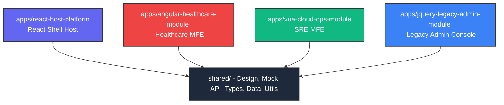

# 🚀 FlowShift: Enterprise Frontend Modernization Platform

[](https://www.typescriptlang.org/)
[](https://react.dev/)
[](https://angular.dev/)
[](https://vuejs.org/)
[](https://vitejs.dev/)

> **FlowShift** is a premium, recruiter-friendly **Frontend Modernization Command Center** designed by a Senior Software Engineer to showcase high-fidelity system integration, micro-frontend orchestration, and legacy-to-modern codebase migration.

The application consolidates **four distinct frontend frameworks** (React, Angular 17, Vue 3, and legacy jQuery) running in unified harmony under a single Vite-powered React host shell, simulating a real-world enterprise modernization project.

---

## 🏛️ System Architecture

FlowShift simulates a modern enterprise dashboard that consolidates remote modules and legacy tools into a unified viewport:



### The 4 Micro-Frontend Engines:
1. **React.js Host Core** (`apps/react-host-platform`): Handles root routing, central session state, global design tokens, and the parent dashboard views.
2. **Angular 17 Container** (`apps/angular-healthcare-module`): Simulates a secure healthcare registry, complete with Angular functional routing guards and debounced search filters.
3. **Vue 3 Telemetry Grid** (`apps/vue-cloud-ops-module`): Renders SRE system status nodes, response metrics, and cloud resource counters.
4. **Legacy jQuery Desk** (`apps/jquery-legacy-admin-module`): Simulates a legacy CRM customer support desk adapter. Legacy DOM event bindings are bridged back to the React shell state.

---

## ✨ Key Technical Implementations & Code Highlights

* **One-Click Guest Access Bypass**: Built an instant **"Explore as Guest (Fast Track)"** authentication flow, allowing recruiters to bypass login screens in under 1 second.
* **Stateful MFE Gateway Control & Fail-Over**: Built a load-testing console on the dashboard. You can click **"Simulate Reset"** to trigger a mock socket failure, watching the telemetry indicators spin in a yellow `RECONNECTING...` state before successfully re-negotiating the handshake.
* **Real-time AES-256 Encryption Toggle**: Allows toggling a security protocol that dynamically translates plain-text latency pings (e.g. `4.8 ms`) into secure hex-encrypted hash outputs (e.g., `0xE5DF (AES)`) across all sub-framework viewports.
* **Monospace Audit Logger**: Displays real-time gateway checks, RxJS debounce completions, and cryptographic handshakes in a terminal interface at the bottom of the dashboard.
* **Interactive Platform Tour Modal**: A glassmorphic onboarding carousel guiding visitors through the architecture, business problem, and integration engine.
* **3D Isometric Micro-Frontend Stack**: Renders a floating 3D perspective stack on the landing page representing the modules using modern CSS transform rules.

---

## 📂 Project Directory Structure

```text
├── apps/
│   ├── react-host-platform/         # Vite + React Host (Global Nav & Shell)
│   ├── angular-healthcare-module/   # Angular 17 Healthcare Sandbox Container
│   ├── vue-cloud-ops-module/       # Vue 3 SRE Cloud Operations Telemetry
│   └── jquery-legacy-admin-module/  # Legacy CRM AJAX Adapter Support Desk
├── shared/
│   ├── data/                        # Simulated database mock datasets (JSON)
│   ├── mock-api/                    # Mock API layer with simulated pings/latencies
│   ├── styles/                      # Central Sass tokens (badges, mixins, variables)
│   ├── types/                       # Shared TypeScript interface definitions
│   └── utils/                       # Common validation filters (regex MRN, email)
├── screenshots/                     # Visual design mocks for GitHub presentation
└── package.json                     # Monorepo task orchestration setup
```

---

## 🚀 Setup & Installation Guide

Get the workspace running locally in under **2 minutes**:

### 1. Prerequisites
Make sure you have **Node.js (v18 or newer)** installed.

### 2. Installation
Clone the repository and install dependency nodes:
```bash
# Clone the repository
git clone https://github.com/sivad5712/Enterprise-Frontend-Modernization-Platform.git
cd Enterprise-Frontend-Modernization-Platform

# Install root & workspace sub-packages
npm install
cd apps/react-host-platform && npm install
cd ../angular-healthcare-module && npm install
cd ../vue-cloud-ops-module && npm install
```

### 3. Run Locally (Development)
Return to the root repository folder and use workspace shortcuts to run individual systems:
```bash
# Start Vite React Host (Port 5173)
npm run dev:react

# Start Vue SRE Telemetry Grid (Port 5174)
npm run dev:vue

# Start Angular Healthcare Module (Port 4200)
npm run dev:angular

# Serve the legacy jQuery support desk (Port 3000)
npm run serve:jquery
```

Open **`http://localhost:5173`** to access the FlowShift console.

---

## 👨‍💻 Interview Talking Points (For Recruiters & Hiring Managers)

When explaining this project in technical interviews, focus on these architecture patterns:

1. **How the Shared design tokens work**:
   * All modules share typography weights, contrast levels, and statuses directly from `shared/styles/variables.scss`, showing how design systems scale across different frameworks.
2. **TypeScript schema alignment**:
   * The Angular and Vue sub-applications import type contracts straight from `shared/types/`, enforcing zero data mismatches between modern and legacy modules.
3. **Optimizing browser event loops**:
   * Explain how the Angular module's RxJS `debounceTime(300)` logic prevents browser frame stutters during high-frequency searching.
4. **Bridging jQuery in modern environments**:
   * Explain how custom JavaScript adapters wrap old-school jQuery DOM handlers, allowing them to pass logs up to the React global telemetry monitor.
