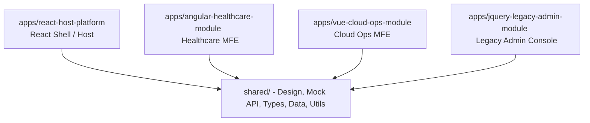

# Architectural Overview

The **Enterprise Operations Command Center** consolidates multiple business features under one single code workspace.

---

## Component Ecosystem

### 1. React Host Shell (`apps/react-host-platform`)
- **Role**: Serves as the primary application shell and portal coordinator.
- **Features**: Auth routers, Recharts analytics dashboards, core banking ledgers search, and mounts sandboxed live simulators for child applications.

### 2. Angular Healthcare Module (`apps/angular-healthcare-module`)
- **Role**: Structured compliance portal managing HEDIS care gaps and member observations.
- **Design**: Standalone Angular components, functional route guards, JWT HTTP headers interceptors, and RxJS input debouncing pipes.

### 3. Vue Cloud Operations (`apps/vue-cloud-ops-module`)
- **Role**: Lightweight telemetry SRE board.
- **Design**: Vue 3 setup composition scripts, Kubernetes scaling, multi-provider cloud cost widgets, and custom SVG line charts.

### 4. jQuery Legacy Admin (`apps/jquery-legacy-admin-module`)
- **Role**: Legacy adapter interface managing support tickets.
- **Design**: Static HTML templates, CDN-linked jQuery/Bootstrap resources, AJAX deferred, and manual form validations.

---

## Infrastructure Foundations

### 1. Shared Styles Tokens (`shared/styles/`)
- Declares centralized dark theme custom properties, margins variables, typography mixes, badge styles, and tables. Consumed directly by React, Angular, and Vue.

### 2. API Adapters Bridge (`shared/mock-api/`)
- Isolates direct database calls inside reusable promise containers. Simulates server lags (300ms - 600ms) to ensure frontend pages display robust spinner states.
