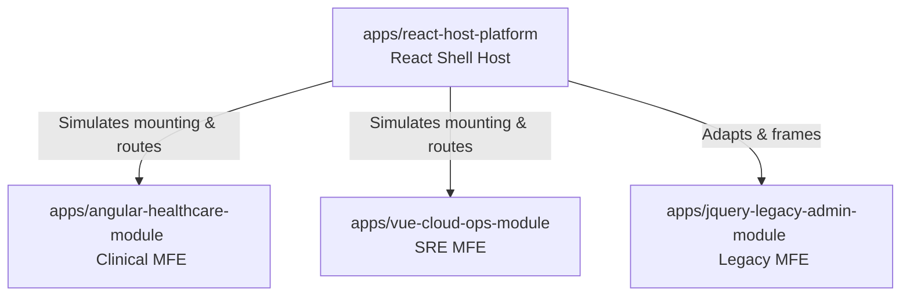

# Micro-Frontend Strategy

This platform uses a high-compliance micro-frontend (MFE) pattern to solve monolithic scaling limitations.

### 1. Why Micro-Frontends?
- **Decentralized Deployments**: Different corporate teams deploy separate features (e.g. Clinical team builds Angular, DevOps SRE builds Vue) without blocking parent release queues.
- **Incremental Upgrades**: Outdated platforms (like the jQuery Admin) receive targeted modernization adapter updates without risking global codebase breakage.

### 2. Integration Models
- **Standard Host Shell**: The React host controls parent headers, sidebars navigation, and authentication contexts, ensuring a cohesive design layout.
- **Workspace Simulators**: Standalone workspaces mount Angular and Vue components inside responsive simulator panels. This layout lets portfolio reviewers inspect all systems within the main Vercel deployment.
- **Production Federated Paths**: Production applications can leverage Module Federation (Webpack/Vite) or import-maps CDN loaders to resolve distant bundles dynamically.
