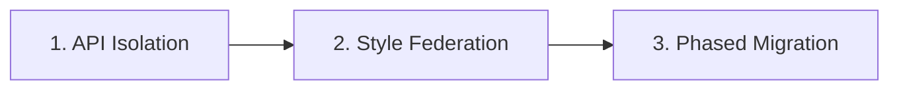

# Frontend Modernization Roadmap

This blueprint details the structural transition of legacy corporate applications into a unified React platform shell.

---

## 1. The Legacy Challenge

### Why do enterprises still maintain jQuery?
1. **Undocumented Business Logic**: Legacy banking controls are often tightly coupled to selectors click listens (`$('#btn-pay').on('click', ...)`). Rewriting this risks losing edge-case constraints.
2. **Ad-Hoc AJAX APIs**: Unstructured, plain JavaScript endpoints without typings standard security headers.
3. **Monolithic Scale**: Rebuilding 300,000+ LLoC clinical dashboards from scratch requires quarters of developer capacity, halting feature delivery pipelines.

---

## 2. Unified Modernization Principles

Modernization follows three core engineering pillars:

### 1. API Isolation
- Direct SQL/query endpoints inside the jQuery layer are refactored into modular promise bridges (`shared/mock-api/`). Allows safe frontend-backend separation.

### 2. Style Federation
- Common colors variables, typography margins, tables grid properties, card mixins, and badges details are extracted into shared styling modules (`shared/styles/`). Standardizes user experience.

### 3. Phased Migration
- Transition AngularJS code to Angular 17. Convert SRE widgets to light Vue 3 setup layouts. Unify portals inside the React host shell. Deprecate legacy jQuery views progressively.

---

## 3. Phased Roadmap Milestones

- **Phase 1: Discovery & Core Audits**: Chart application matrices, complexity scores, and target schemas registries. *(COMPLETED)*
- **Phase 2: Common Design tokens**: Unify dark theme variables, borders custom properties, and mock data. *(COMPLETED)*
- **Phase 3: Sandbox Integration**: Deploy the React host, mount MFE simulators, and verify secure route guards. *(COMPLETED)*
- **Phase 4: Legacy Deprecation**: Transition jQuery admin tasks to native React components and deactivate legacy systems. *(PLANNED)*
